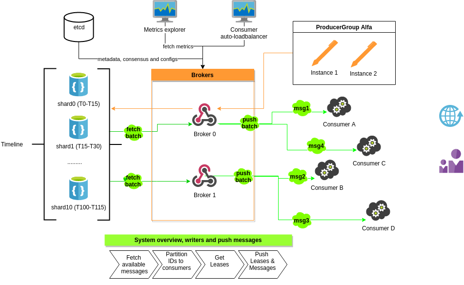
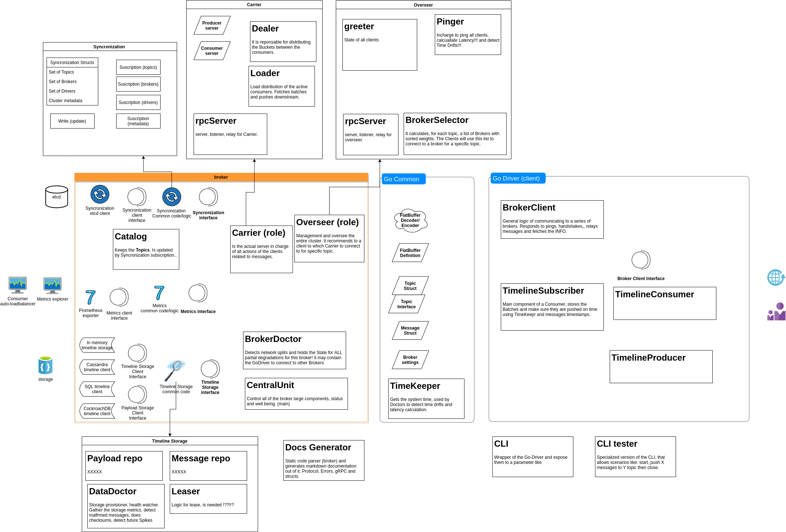

DejaQ

# About

DejaQ is a distributed messaging queue built for high-throughput persistent messages that have an arbitrary or time-based order. It allows a point-to-point scheduled message-oriented async communication for loosely coupled systems in time and space. The main properties are:

 * ACID transactions on messages 
 * CR[u]D operations can be made on messages (topic mutability)
 * messages can be scheduled in any order (flexibility)
 * multiple consumers can process in parallel from multiple brokers (scalability)
 * Accuracy and high-throughput using commodity hardware

The system will support multiple types of topics.
Timeline topics: 
 * a message has a Timestamp (not good before) (scheduling) that dictates when the message will be sent to the consumers
 * we strive to deliver the messages at a single digit millisecond accuracy
 * the messages are stored in a timeline data-structure and their location is the actual UTC timestamp property
 * the consumers will receive the available messages from the past (message.timestamp <= now()), but the clients (drivers) will prefetch/preload the messages before the delivery time.

PriorityQueue and CronJob topics are next on the agenda.

The messaging queue must not be confused with the Abstract type Queue (where the elements can only be added from one way and read from the other). 
The system will try to leverage/reuse as much as possible from the existing storage technologies (avoid to reinvent the wheel) and act more like a wrapper. Building a custom persistent scalable storage engine is on the roadmap.

Because of the mutability and flexibility properties, the system will never be able to scale as simple and as well as other simple immutable queue messaging systems like Kafka, RabbitMQ and SQS. We will try to make it happen and reach a reasonable scalability (M/s) with decent hardware requirements.

# Intro
This document is the V2 architecture draft, notes and research results. It was written by Bledea Georgescu Adrian with main contributions from: Mihai Oprea and Sandu Samyr David. Consultant: Radu Viorel Cosnita.

## Terms 
System is the group of DejaQ logic, SDK, scripts, broker, network, etcd and the storage.
Messages can be: messages, jobs, items in a queue, anything that can be represented in a series of bytes.
Topic: a collection of messages
Timeline is a Topic type of messages ordered by the datetime (collection)
Lease - (lock, ACKnowledge) is the consumers action of acquiring a message lock and the System confirmation that the consumer can start process that message. Only 1 consumer can have the lease of a message at a specific time. The lease will always have a timeout.
Extend - a consumer ability to extend its lease (lock) on a message
Release - The consumer action of releasing an active lease (lock) on a message and scheduling it again in the future (eg: retry)
Delete - is the action to remove a message from the timeline
Owner - the producer group that created the message
Producer group - A group of producers that share the same ID and ownership of their messages 
Producer - a process that can publish messages
Consumer - a process with a unique ID that can consume messages
Client - an instance of the SDK, a client of the broker, usually one per machine/vm/docker. Can contain 0+ consumers and 0+producers
Cluster - a group of Topics, Brokers, Processes that share the same Storage and Network
Broker - the main actors of the system that handles all the messages and keep things running.
## Main usages 
Simplest answer to “When should I use DejaQ with a timeline” is: When you need a specific Message to reach a consumer at a specific time (hopefully with a single digit ms latency). 

Best use case is the Point-to-point messaging paradigm (where only one consumer has to receive a message, opposite to SubPub).The system is best suited for apps that:
Consumers are decoupled from producers in Time and Space
Consistency and Persistence is required with ACID properties
You have 1+ Producer groups and only 1 type of consumers (consumer group in other systems)
Messages are consumed async and have a lifespan of at least a few seconds
Messages have to be processed in a specific order (NOT in the order they were created)
Payloads are immutable (planned to change)
need of preemption at the app/message level (interrupt a task, put it back into the topic, it will be served later)

Other needs that a timeline (the topic) can satisfy:
Control the processing of the message with millisecond accuracy
Messages May recur/processed multiple times (consumers can move the messages on timeline)
Complex retry mechanism (save this message for later)

If your app needs a Pub/Sub messaging queue, CommitLog, Stream processing or an Event Sourcing type of messaging DejaQ is not the best solution for you.

-------------------------------------------------------------------------------

# Architecture & responsibilities 

The base design is simple, store a timeline with documents sorted by timestamp. 
But because time goes by (independent of the system and client actions), we have to assure consistency and scalability everything got more complicated. Most of the decisions are made to fix the side effects. 

## Architecture principles (order is most important)

 * Consistency: although conflicts with the performance and accuracy, we have to do atomic and persistent write operations (ACID) that leads to “Strong-consistency” at the storage level and stale data detection at the broker and SDK level. Scheduled messages are usually one time transactions and we have to make sure there are no duplicates, misses or lost data. DejaQ is a CP (in CAP). This choice will have a negative effect on the High-Availability and write-performance of the system.
 * Accuracy : (precision on timeline) we want to assure the minimal latency possible to deliver the messages to a consumer (at the time producer specified)
 * Scalability: horizontal scaling has to be applied to all layers: producers, storage, brokers and consumers. Having a strong-consistency reads can be made from any replica.
 * Reliability: the brokers especially has to withstand and be available as long as they could. Partially degradation will be applied to more levels. This leads to a mandatory high quality of the system, from design to recovery scenarios and failovers.
 * Delivery guarantees: although not in the first 3 priorities, the system chooses at-least-once-delivery, and strive to deliver only-once. As in all systems, this is a shared responsibility with the user.
 * Visibility: the system will provide all the metrics, alerts and logs its possible, making them first class citizens in the implementation. The side effects will be: audit trails, good capacity planning, early detect of data loss and other issues.
 * High-availability: at a network split we will choose consistency, but availability is assured by horizontal scaling at all levels (eg: storage replicas).
 * Security: the system will support optional encryption at rest and in transit. Ofc the users are free to encrypt the body of the messages too.
 * Control: all the settings has to be exposed so the user has the full control of the behaviour of the system
Ease of use: Common use cases: we will ensure that the top use cases we support are well documented and examples already made. SDKs and protocols will have to be self explanatory and a suite of tools will be officially supported. 
 * Documentation: the Documentation will be generated as well as the SDKs ensuring that they are always updated. Design documents has to be updated before any decisions or implementation is made.
 * Data visibility: Producers and clients directly accessing the brokers will have full control over the data.

## Actors 

There are 5 main actors in the system: 
 * The storage (hidden for the user)
 * The broker (the main piece of the system)
 * The client - broker clients, (SDK) helper functions and instances to call the broker
 * The user - that uses an SDK, or the broker directly, your business logic
 * Synchronization service (naming, sync, configuration)

In one network is recommended to have only 1 Cluster. A cluster must have:
 * only 1 storage 
 * 1 cluster of Synchronization service (etcd, eg: 3 instances)
 * At least 1 broker

A cluster may have any number of clients connected to brokers and any number of topics.

## Consistency 

In the CAP theorem DejaQ is CP. A brain split/partition can appear at a broker level and it will not affect the availability as long as:
Read - coordinator can access a replica that is up to date
Write - coordinator can write to all replicas
If these operations cannot be done the Consistency can be affected so the system will prevent them by entering a degradation state (not available).

Writes (mutations) are made by the producers and the consumers (by acknowledge or removing the messages) and acknowledged by all replica sets. To avoid race-condition or data losses messages have a versioning system (backed up by a conditional update in the storage).

The consistency guarantee is given only in the DejaQ bounds, for example in a Timeline topic from a consumer point of view the bounds ends when a lease expires: the consumer only has a snapshot, the message can be modified but the consumer will not be notified. This can also happen without the client's knowledge when a Time-drift (future offset) occurs (the consumers SDK THINKS it has a valid Lease but the lease expired)

## High Availability 
Brokers should be scaled horizontally and have dedicated resources. The SDKs will connect to multiple brokers. 
Because all brokers have the same role, when one fails the load and attributions can be distributed between the remaining ones.
The storage will also have replicas, this way there is no single point of failure in DejaQ.
Network splits will be detected using the Synchronization Service.
## Clusters 

A cluster has a name that will acts as a prefix to all topics, this way the storage and the network can be shared between multiple clusters.
Clusters existence is an effect not an active creation, spawning brokers with the same ClusterName and connecting between them makes a cluster.

## Modules

