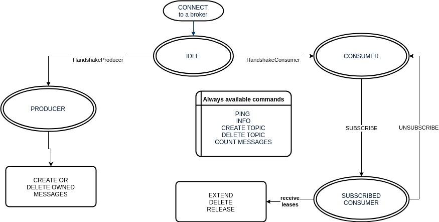
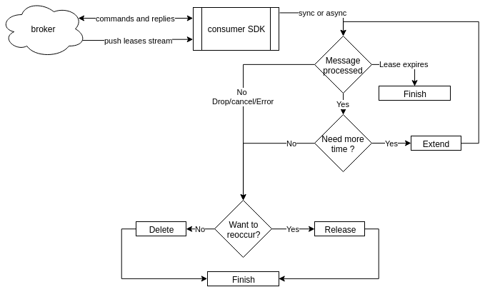

# The Client
An entity connected to the broker is called “a client”. The client can be either IDLE, a consumer or a producer.
The Consumer and Producer states are final (it cannot be switched), this is because of the stateful protocol.

(the STATES of a connected CLIENT, from broker perspective)

## The producer
Is the only entity allowed to CREATE new messages. Each producer is part of a ProducerGroup identified by a unique ID. All messages created by a group are tagged accordingly (the ProducerGroupID is stored in the message metadata) and they remain the OWNER of the message.
The messages can be deleted by an OWNER as long as there is no active lease on them.
## The consumer
The consumer is responsible to process the messages it receives (contained by leases). It has to delete or release the message in order to free the Available messages queue.
It can choose to process the messages in parallel (or async), but starting multiple consumers in a process is preferable. 
Once the lease is expired or the message is deleted or released, the consumer has to remove all references to the message.

Consumer actions (for each lease received)
# The SDK
The SDKs are the default and official clients for the broker. They are a collection of scripts, classes and helper functions built for a specific programming language. The first supported language is Go. Java&Python are on the roadmap.

The SDK should not contain any vital feature required by the cluster to perform its actions. The USER should be able to build its own broker client in any language. 

Responsibilities:
Connect and discover brokers 
alert/error when time-drifts are detected 
Provide helpers and easy to use APIs
Generate unique message IDs (at create, if a naturalID is not provided)
Based on the systems time check the validity of a lease
Minimize network trips and traffic
Allow and Encourage the USER to use Batching (create, Lease and Delete)

Create() command has to generate the taskID (if is not received) and return it to the caller. This way the caller can do idempotent retries, decreasing the chances of a duplicate message (when more failures occurs). 

Subscribe may return the same message for multiple consumers, but the Lease will only work for 1 consumer.

The USER can attach a callback to the SDK and it will be called when a TimeDrift is detected (the system time is different than the average of the brokers). The USERs can put an alert on it and fix the issue before affecting the system.

All the time-related parameters should be able to call with absolute values OR with relative seconds, eg: Release(UTCTimestamp) and ReleaseRelative(seconds).

SDK can provide the producers a FANOUT helper functionality (write the same message on multiple topics). 

PushLeases will send the messages in the order of the timestamp. The lease expiration may differ, eg: after a consumer recovers it will receive all its previous leases and new ones.

If is able to, the SDK should provide an auto-extend functionality, to make it easier to maintain the lease active, eg: liveness probe/callback on the actual consumer. TODO research 
## Generator
TODO decide if we write the SDKs from scratch or we use a generator like https://github.com/dropbox/stone 
Further research needs to be done. After we decide the Transport and Protocol we can search for solutions that can help us for Go, Java with optional Python and JavaScript. 

2ND alternative would be (if we choose to use gRPC or a popular alternative that already generates some boilerplate code) would be to build idiomatic-hands on SDKs and search for more contributors. 

## Broker compatibility
Each broker version will have a “minimum” hard-coded protocol and SDK versions its compatible with. 
Each Broker release, SDK Release and Protocol release may be compatible with one another or not. 
We will strive to :
Make few or none backward incompatible releases (major versions)
Allow clients to have different versions in the same cluster (to allow soft-rollouts updates)
Have at least a few versions window-gap compatibility eg: Broker v1.5 should work with SDK v.1.3-v1.7

## Connection 
SDK needs a seed list of brokers. Connects to one of them, if fails goes to next and so on. 
After a connection it sends an INFO command. 
It stays in standby until a consumer/producer is instantiated on a specific topic.

All the parameters will be configurable by the Client (with a value of 1 the load will be split evenly, with a value of 8 the brokers will be very focused on a single topic).  
